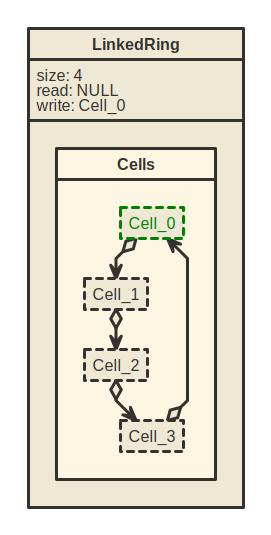
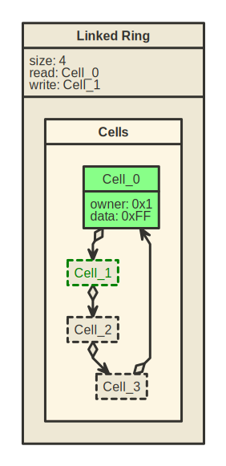
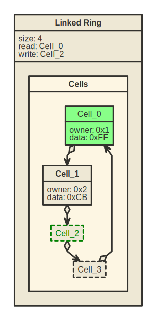
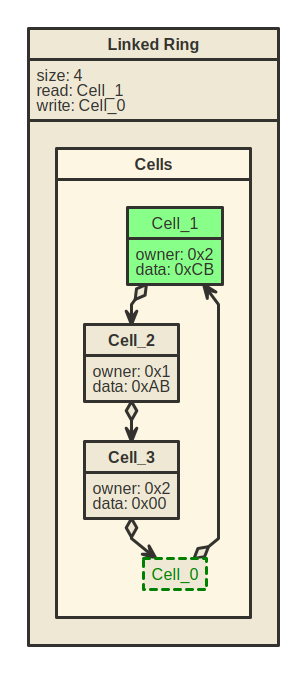
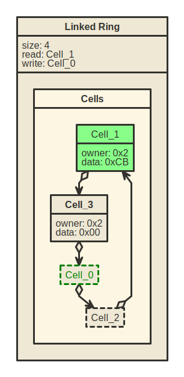

# Linked Ring Buffer Library

## Contents

1.  [Introduction](#introduction)
    -   [Use Cases](#use-cases)
    -   [Library Description](#library-description)
2.  [Getting Started](#getting-started)
    -   [Initializing a Linked Ring Buffer](#initializing-a-linked-ring-buffer)
    -   [Adding Data to the Buffer](#adding-data-to-the-buffer)
    -   [Removing Data from the Buffer](#removing-data-from-the-buffer)
3.  [Performance](#performance)
    -   [Memory Consumption](#memory-consumption)
4.  [Circular Buffers vs Linked Rings: A Comparison](#circular-buffers-vs-linked-rings-a-comparison)
    -   [Memory Consumption](#memory-consumption)
5.  [License](#license)
6.  [Making a Contribution](#making-a-contribution)
7.  [Credits](#credits)

## Introduction

This is a C library for Linked Ring data structures, which provide a mechanism for using _a single allocated buffer for multiple producers_. It's just **in place replacement for ring buffer**, but without taking up all that extra space for multiply buffers used by different producers-consumers.

Linked ring is a type of fixed-size buffer with operations are performed in First In First Out (FIFO) order.

The library provides functions for initializing, adding and removing elements from buffer. 

### Use Cases
The Linked Ring data structure could be used in _case of statically allocating a single buffer for multiple producers_, tasks in an embedded system.

_It is not_ designed to replace `malloc` or pool allocators, but for situations where there is a data stream with unknown size and multiple agents operating. It allows _Linked Ring replacement in place of the ring buffer_ for usage single 256-byte "ring buffer" instead of `N * 256`.

### Library Description

Struct called `struct linked_ring` represent a linked ring buffer. This struct contains pointers to the cells that make up the buffer, as well as information about the `size` of the buffer, the current `read` and `write` positions, and the `owners` of the elements in the buffer.

A struct called `struct lr_cell` represent an element, which consists of a `data` field and an `owner` field, as well as a pointer to the `next` element in the buffer.

The size of each element in the buffer is determined by the type of data stored in the `lr_data_t` and `lr_owner_t` fields. If a 64-bit system is used, the element will consume `8 bytes` of memory, or `4 bytes` in case of 32-bit system.

The library provides a number of functions for initializing and manipulating linked ring buffers, such as:
-   `lr_init()`, which initializes a new linked ring buffer
-   `lr_put()`, which adds an element to the end of the buffer
-   `lr_get()`, which removes an element from the front of the buffer for a specific owner

It also provides utility functions such as:
-   `lr_count()`, which returns the number of elements in the buffer
-   `lr_exists()`, which checks whether an element with a specific owner is present in the buffer

#### Diagrams

The following diagrams show the different states of a linked ring buffer with 4 elements:

| Empty                                    | `lr_put(&buffer, 0xFF, 0x1)` will add `Cell_0`                           | `lr_put(&buffer, 0xCB, 0x2)` will add `Cell_1`                           |
| ---------------------------------------- | ----------------------------------------- | ------------------------------------------ |
|  |  |  |

| Filled Buffer                           | `lr_get(&buffer, &obtain_data, 0x1)` will retrive `Cell_0`                               | `lr_get(&buffer, &obtain_data, 0x1)` will retrive `Cell_2`                                  |
| --------------------------------------- | ----------------------------------------------- | --------------------------------------------------- |
|  |  |  |

## Getting Started

To use the Linked Ring library in your project, you will need to include the `lr.h` header file in your source code and link against the library when compiling.

### Initializing a Linked Ring Buffer

To initialize a new linked ring buffer, you can use the `lr_init()` function. This function takes a pointer to a `struct linked_ring` and the `size` of the buffer (in number of elements) as arguments, and returns an `lr_result_t` enum indicating the result of the operation.

For example:

```c
#include <linked_ring.h>

#define BUFFER_SIZE 10
struct lr_cell cells[BUFFER_SIZE];
struct linked_ring lr;

lr_result_t result = lr_init(&lr, BUFFER_SIZE, cells);
if (result != OK) {
    // Error initializing the buffer
}
```

### Adding Data to the Buffer

To add data to the end of the buffer, you can use the `lr_put()` function. This function takes a pointer to a `struct linked_ring`, a `data` value, and an `owner` value as arguments, and returns an `lr_result_t` enum indicating the result of the operation. The `owner` value is used to associate the data with a specific consumer or user.

For example:

```c
lr_data_t data = 50303;
lr_owner_t owner = 31337;

lr_result_t result = lr_put(&lr, data, owner);
if (result != OK) {
	// Error adding data to the buffer
}
```

### Removing Data from the Buffer

To remove data from the front of the buffer, you can use the `lr_get()` function. This function takes a pointer to a `struct linked_ring`, a pointer to a `lr_data_t` variable, and a pointer to a `lr_owner_t` variable as arguments, and returns an `lr_result_t` enum indicating the result of the operation. The `lr_get()` function will store the `data` value of the element being removed for specific `owner`.

For example:

```c
lr_owner_t owner = 31337;
lr_data_t obtain_data;

lr_result_t result = lr_get(&lr, &obtain_data, owner);
if (result != OK) {
	// Error removing data from the buffer
}
```

## Performance

The performance of the Linked Ring data structure depends on the size of the buffer, and the number of elements stored in it. The larger the buffer simultanius consumers, the more time it will take to remove elements for specific owner from it (`O(n)` because `owners` bitfield need to recompute). Adding elements to a linked ring buffer is an `O(1)` operation.

### Memory Consumption

The Linked Ring data structure requires a fixed amount of memory to store the buffer. The size of each element in the buffer is determined by the type of data stored in the `lr_data_t` and `lr_owner_t` fields. If a 64-bit system is used, the element will consume `8 bytes` of memory, or `4 bytes` in case of 32-bit system.

The total amount of memory consumed by the Linked Ring buffer and structure can be calculated as follows:

```
Memory Consumption = (size * (sizeof(lr_data_t) + sizeof(lr_owner_t) + sizeof(struct lr_cell *))) + sizeof(struct linked_ring)
```

### Circular Buffers vs Linked Rings: A Comparison

Circular buffers and linked rings are both types of fixed-size buffers that are useful for storing and accessing data in a _FIFO (first-in, first-out)_ manner. In a circular buffer, the data is stored in an array, while in a linked ring, the data is stored in a series of linked cells that form a circular chain.

There are a few key differences between circular buffers and linked rings that may influence when you would choose to use one or the other:
-   **Memory usage**: A circular buffer requires a contiguous block of memory to store the data, whereas a linked ring can store the data in non-contiguous cells that are linked together. This means that a linked ring may be more suitable if you need to allocate a buffer in situations where you cannot guarantee that you will have a contiguous block of memory available.
-   **Data access**: In a circular buffer, data can be accessed randomly, but accessing data in a linked ring requires following the pointers from one cell to the next. This means that a circular buffer may be more efficient if you need to access data randomly within the buffer.
-   **Insertion and deletion**: Both circular buffers and linked rings support insertion and deletion of data at the front and end of the buffer, but _linked rings may be more efficient at inserting and deleting data in the middle of the buffer_, since this does not require shifting the data around in memory as it does in a circular buffer.

The performance of Linked Ring Buffers is due to the fact that the buffer is only initialized once and all consumers can access the same buffer. This reduces the overhead of initializing and allocating multiple buffers, which is required with Circular Buffers.

The performance of Linked Ring Buffers also depends on the size of the buffer and the number of producers. In general, the larger the buffer and the more consumers accessing it, the more memory efficient the Linked Ring Buffer will be.

#### Memory Consumption

Linked Ring Buffers use more memory than Circular Buffers. The amount of memory saved by using Linked Ring depends on how many producers can use the buffer.

In `N` multiple consumer case we allocate just one linked ring buffer and `N` circular buffers of `BUFFER_SIZE` size.

Linked ring buffer size in this case is equal to `BUFFER_SIZE * (sizeof(lr_data_t) + sizeof(lr_owner_t) + sizeof(struct lr_cell *)) + sizeof(struct linked_ring)`

Therefore, memory consumption of Linked Ring Buffer in multiple producer case is the same while memory consumption of Circular Buffer is equal to `N * BUFFER_SIZE * sizeof(lr_data_t) + sizeof(struct linked_ring)`

As we can see, Linked Ring Buffer uses less memory in multiple consumer case.

#### Thread-safety
- The Linked Ring Buffer Library, by default, is not thread-safe. However, the user can override this behavior by passing in custom lock and unlock functions, which the library will call to ensure that all operations, except for `lr_dump`, are thread-safe. `lr_dump` is a debugging function so it is assumed that the caller is taking extra measures to protect against race conditions. 

## License

The Linked Ring Buffer Library is licensed under the MIT License, as described in the LICENSE.md file. This license allows users to use, modify, and distribute the code as they see fit, with minimal restrictions. Please be sure to read and understand the terms of the license before using the code

## Making a Contribution

The Linked Ring Buffer Library is an open source project, and we welcome contributions from the community! There are several areas where you can make a meaningful contribution to the library:

-   **[Add Option to Overflow Filled Buffer](https://github.com/fefa4ka/linked_ring/issues/1)**: Currently, the buffer is fixed-size and cannot hold more elements than its size. You can help by adding the option to allow the buffer to overflow when it is filled, discarding the oldest data in favor of the new data. This could be useful in certain scenarios where it is necessary to store more data in the buffer than it can hold. You could modify the `lr_put()` function to check if the buffer is full before adding a new element, and provide a flag or configuration option to allow users to specify whether they want to enable overflow behavior or not.
-   **Convenient Definition of an Arbitrary Data Type for Elements**: Currently, the `lr_data_t` field is defined as a `void * type`, which allows for the storage of any type of data. However, this can be inconvenient for users who want to store specific types of data in the buffer. You can help by providing a more convenient way for users to define the data type for elements in the buffer.
-   **Use Hash Tables** for `O(log n)` Buffer Reads: Currently, the `lr_exists()` function has `O(n)` time complexity, meaning that it takes longer to execute as the number of elements in the buffer increases. You can help by implementing a hash table-based solution that allows for `O(log n)` time complexity for this function.
-   **Measure and Compare Performance**: The Linked Ring Buffer Library is designed to be efficient and performant, but it is always important to verify and validate these claims. You can help by implementing performance tests and benchmarks to measure and compare the performance of the Linked Ring Buffer Library with other data structures.
-   **Add More Utility Functions**: The Linked Ring Buffer Library currently provides a limited number of utility functions. Adding more utility functions, such as those for iterating through the elements in the buffer or finding specific elements, could make the library more useful and flexible.

We hope these ideas inspire you to make a contribution to the Linked Ring Buffer Library! We look forward to reviewing your pull request.

## Credits

-   Alexander Kodratev (alex@nder.work)
